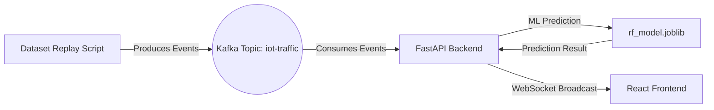

https://www.youtube.com/watch?v=YXkMHRJ58b8# Apache Kafka: A Guide for CityShield

## What is Apache Kafka?
Apache Kafka is an open-source distributed event streaming platform used by thousands of companies for high-performance data pipelines, streaming analytics, data integration, and mission-critical applications. 

In simpler terms: **Kafka is a highly scalable, fault-tolerant message queue.** It acts as a massive shock absorber between systems that produce data (like IoT devices) and systems that consume data (like our FastAPI ML backend).

---

## Core Concepts You Need to Know

1. **Producer**: An application that sends data *to* Kafka. 
   - *In CityShield:* We will build a Python script (the "Replay Script") that reads the 2.8GB CICIoT2023 dataset row by row and acts as a Producer, blasting thousands of network events per second into Kafka.

2. **Consumer**: An application that reads data *from* Kafka.
   - *In CityShield:* Our FastAPI backend (`main.py`) will act as a Consumer. It will continuously pull events from Kafka, run them through our Random Forest model (`rf_model.joblib`), and then broadcast the results to the React frontend.

3. **Topic**: A category or feed name to which events are published. Think of it like a specific folder or a radio channel. 
   - *In CityShield:* We might create a topic named `iot-network-traffic`.

4. **Broker**: A single Kafka server. Kafka runs as a cluster of one or more brokers that can span multiple data centers or cloud regions.

5. **Zookeeper / KRaft**: Kafka used to rely on a separate service called Zookeeper to manage its clusters. Modern Kafka uses a built-in consensus protocol called KRaft.

---

## Why do we need Kafka in CityShield?
Currently, our `main.py` generates one fake event every 1.5 to 2.0 seconds. This is fine for a prototype, but real-world IoT networks generate **massive spikes** in data, especially during a DDoS attack (millions of packets per second).

If the IoT devices (or our replay script) sent data directly via HTTP to the FastAPI server:
1. **The Server would Crash**: FastAPI would be overwhelmed by the sheer volume of requests faster than the ML model can predict them.
2. **Data Loss**: If the ML engine takes 50 milliseconds to process a batch, any incoming packets during that 50ms window might be dropped if the server's HTTP queue is full.

**With Kafka in the middle:**
The Replay Script can dump 100,000 events per second into Kafka. Kafka's brokers will safely store all of them. The FastAPI backend can then consume them at its own pace (e.g., 5,000 events per second). **No data is lost, and the backend never crashes.**

---

## How we will integrate it into CityShield

Here is the architectural flow we are going to build:

### Steps to Implement:
1. **Install & Run Kafka**: We will set up a local Kafka instance (usually via Docker for simplicity, or downloading the binaries).
2. **Create the Producer Script**: A new file (e.g., `kafka_producer.py`) that reads `val_dataset.pt` or the original CSV and sends it to a Kafka topic.
3. **Update the Backend**: Modify `main.py` and `event_engine.py` to connect to Kafka, consume the messages, run the ML prediction, and emit to WebSockets.

Once you have read through this, let me know, and we can begin Step 1: Setting up Kafka locally!
